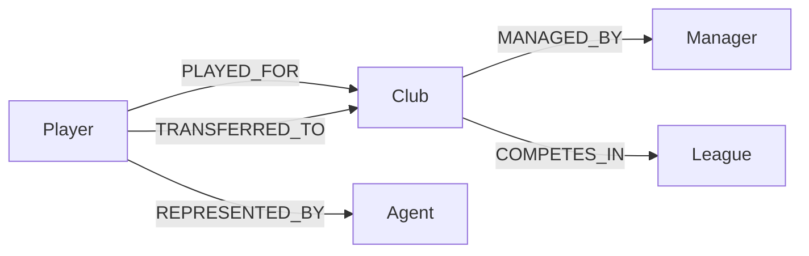
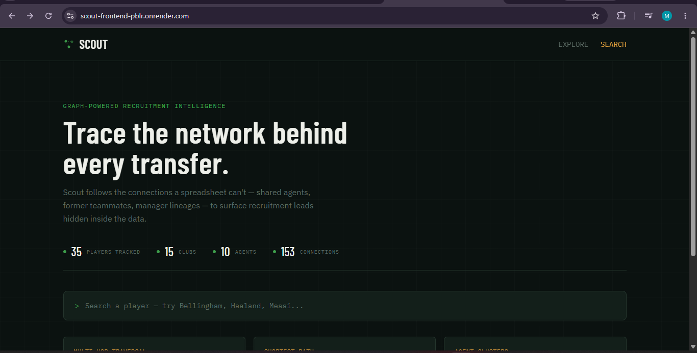
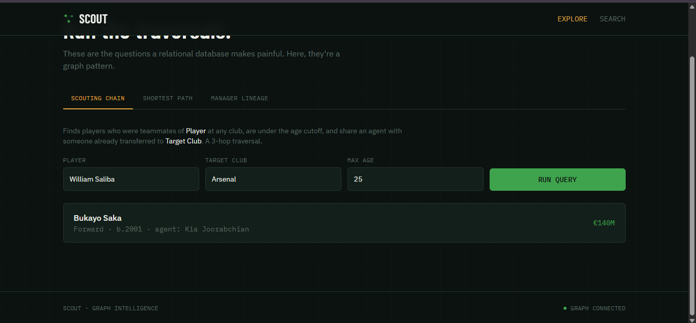

# Scout — Graph-Powered Football Scouting Intelligence

**Live demo:** https://scout-frontend-pblr.onrender.com
**Backend API:** https://scout-backend-2krc.onrender.com
**Note:** the backend is on Render's free tier and may take 30–50 seconds to wake up on the first request after inactivity.

> **New to football?** No background needed. A quick glossary before we
> start: a **club** is a team (e.g. Real Madrid). A **transfer** is when a
> player moves from one club to another, usually for a fee. An **agent**
> represents a player and negotiates their moves — most players share an
> agent with several others, and agents often move multiple clients to the
> same club over time. A **manager** is the club's head coach. Everything
> below builds on just these four ideas.

Scout is a recruitment-intelligence tool for football clubs. Its job is to
answer questions a normal spreadsheet is bad at answering — not "what are
this player's stats," but questions about **how people and clubs are
connected**:

- *"Which young players are one connection away from someone we already
  scouted — through a former teammate or a shared agent?"*
- *"How many steps separate two players' careers?"*
- *"Which agents keep placing their clients at the same club, and when?"*

These are all *relationship* questions — the answer lives in the
connections between people, not in any single row of data. That's exactly
what a **graph database** is built for, and exactly what a traditional
table-based database struggles with. Football transfers just happen to be
a rich, real-world dataset full of these connections (players share clubs,
share agents, get scouted through the same networks) — but the same graph
approach applies just as well to hiring pipelines, supply chains, or fraud
detection. Football is simply the lens Scout uses to demonstrate it.

---

## Why a graph database?

Take the app's signature question: *"Find players who used to play alongside
Player X, are young enough to be worth scouting, and happen to share an
agent with someone who already moved to our target club."*

That's three separate "hops" of connection:
1. Player X → **former teammates** (people who played at the same club at
   the same time)
2. Those teammates → **their agent**
3. That agent → **any other client of theirs** who has already transferred
   to the club we're interested in

In a normal table-based (relational) database, each of those hops means
joining a table to itself or to another table — and doing it three times in
a row makes the query long, slow, and hard to read as the dataset grows.

In a graph database, people and clubs are stored as **nodes**, and their
relationships (played for, represented by, transferred to) are stored as
direct **connections** between those nodes. Answering the question above
just means walking three connections in a row — the query reads almost like
the English sentence describing it:

```cypher
MATCH (source:Player {name: $player_name})-[:PLAYED_FOR]->(:Club)<-[:PLAYED_FOR]-(candidate:Player)
WHERE candidate.name <> $player_name AND candidate.birth_year >= $min_birth_year
MATCH (candidate)-[:REPRESENTED_BY]->(agent:Agent)
MATCH (agent)<-[:REPRESENTED_BY]-(:Player)-[:TRANSFERRED_TO]->(:Club {name: $target_club})
RETURN DISTINCT candidate.name, candidate.position, candidate.birth_year, agent.name
```

And because a graph database only has to explore the *neighborhood* around
the starting point (not scan or re-join entire tables), this stays fast even
as the dataset grows to thousands of players — while the equivalent
relational query only gets more expensive with scale.

---

## Data model

> **Note on the two player→club relationships:** `PLAYED_FOR` records a
> playing *stint* (how many years, appearances, goals — this is career
> history). `TRANSFERRED_TO` records the *move itself* (the year, the fee
> paid, whether it was a permanent deal, loan, or free transfer). A player
> can have several `PLAYED_FOR` stints but only one `TRANSFERRED_TO` edge
> per actual transfer — this separation is what makes the agent-cluster and
> scouting-chain queries possible without conflating "where someone played"
> with "how they got there."



**Nodes**
| Label | Properties |
|---|---|
| `Player` | `name`, `position`, `nationality`, `birth_year`, `market_value` |
| `Club` | `name`, `country`, `founded` |
| `Agent` | `name`, `agency` |
| `Manager` | `name`, `nationality` |
| `League` | `name`, `country`, `tier` |

**Relationships**
| Type | Direction | Properties |
|---|---|---|
| `PLAYED_FOR` | Player → Club | `from_year`, `to_year`, `appearances`, `goals` |
| `TRANSFERRED_TO` | Player → Club | `year`, `fee`, `transfer_type` |
| `REPRESENTED_BY` | Player → Agent | — |
| `MANAGED_BY` | Club → Manager | `from_year`, `to_year` |
| `COMPETES_IN` | Club → League | — |

Seed data: 35 real players, 15 clubs, 10 agents, 7 managers, 5 leagues —
123+ relationships, including real transfer history (Mbappé, Haaland,
Bellingham, Ronaldo's four-club career, etc.) so multi-hop queries return
genuine, non-trivial results.

---

## Main queries

| Query | Endpoint | In plain terms | What it demonstrates technically |
|---|---|---|---|
| **Scouting chain** | `GET /api/network/scouting-chain` | "Find young players connected to Player X through a former teammate, where that teammate's agent has already placed someone at our target club." | A 3-hop traversal: teammates → filtered by age → filtered by shared agent → filtered by that agent's other clients' transfer history |
| **Shortest path** | `GET /api/network/shortest-path` | "How many clubs apart are these two players' careers?" | `shortestPath()` traversal via shared clubs — expensive to express relationally |
| **Manager lineage** | `GET /api/network/manager-lineage` | "Which players already know this manager's style, because they played under them somewhere else?" | Players who played under a manager who later took charge at a different club |
| **Agent clusters** | `GET /api/clubs/<club>/agent-clusters` | "Which agents keep sending their clients to this specific club?" | A `GROUP BY`-then-`HAVING` pattern that's natural in a graph but awkward across normalized relational tables |
| **Similar players** | `GET /api/players/<name>/similar` | "Who else plays the same position at a similar value?" | A simple graph-native recommendation query |

All queries are **parameterised** through the official Neo4j Python driver —
no string-concatenated Cypher anywhere in the codebase.

---

## Screenshots

**Landing page** — live graph telemetry pulled directly from CognoDB (player, club, agent, and connection counts update from the real database, not hardcoded):



**Scouting chain query** — the signature 3-hop traversal in action. Given a player and a target club, it returns real candidates connected through a shared agent:



*(Full walkthrough, including the player dossier, network graph, and club pages, is in the screen recording linked in the submission email.)*

---

## Tech stack

- **Database:** CognoDB (Neo4j-compatible graph database), accessed via the official `neo4j` Python driver over Bolt
- **Backend:** Python, Flask, Flask-CORS, python-dotenv, Gunicorn (production)
- **Frontend:** React 18, Vite, Tailwind CSS, Framer Motion, `d3-force` (custom-styled network graph, not a generic library skin)
- **Hosting:** Render (Web Service for the API, Static Site for the frontend)

---

## Project structure

```
scout/
├── backend/
│   ├── app.py                  # Flask entry point + health check
│   ├── db.py                   # CognoDB connection, retry-hardened for
│   │                            # networks with IPv6-only/NAT64 quirks
│   ├── routes/
│   │   ├── players.py          # search, detail, teammates, similar
│   │   ├── clubs.py            # search, squad, agent-clusters
│   │   └── network.py          # scouting-chain, shortest-path,
│   │                            # manager-lineage, graph stats
│   └── scripts/
│       ├── seed_data.py        # 35 real players + clubs/agents/managers
│       ├── load_seed_data.py   # idempotent loader (MERGE-based)
│       └── test_connection.py
└── frontend/
    └── src/
        ├── components/
        │   └── NetworkGraph.jsx  # hand-styled force-directed graph
        ├── pages/
        │   ├── Landing.jsx       # search + live graph telemetry
        │   ├── PlayerDetail.jsx  # dossier + network + similar players
        │   ├── ClubDetail.jsx    # squad + agent clusters
        │   └── Explore.jsx       # the three signature multi-hop queries
        └── api.js
```

---

## Setup and run instructions

### 1. Create a CognoDB Cloud instance
1. Sign up at [console.cognodb.com/signup](https://console.cognodb.com/signup) (free tier, no card required)
2. Create a free (c0) instance
3. Save the connection URI (`bolt+s://<instance-id>.databases.cognodb.cloud`) and the generated password (shown once) — you'll need both below

### 2. Backend
```bash
cd backend
pip install -r requirements.txt
cp .env.example .env
# Edit .env: paste your CognoDB URI, username (cognodb), and password

python scripts/test_connection.py   # should print "✅ Connected to CognoDB"
python scripts/load_seed_data.py    # loads all seed data into your instance
python app.py                        # starts the API on http://localhost:5000
```

### 3. Frontend
In a separate terminal:
```bash
cd frontend
npm install
cp .env.example .env
# Edit .env if your backend runs somewhere other than localhost:5000

npm run dev   # starts on http://localhost:5173
```

### 4. Verify
Open `http://localhost:5173`. The footer should read **"GRAPH CONNECTED"**.
Search for a player (e.g. "Haaland") to confirm the full stack is wired up.

---

## Deployment

Both services are deployed on [Render](https://render.com):

- **Backend** — Web Service, root directory `backend`, build command
  `pip install -r requirements.txt`, start command `gunicorn app:app`,
  with `COGNODB_URI`, `COGNODB_USERNAME`, `COGNODB_PASSWORD` set as
  environment variables (never committed to the repo).
- **Frontend** — Static Site, root directory `frontend`, build command
  `npm install && npm run build`, publish directory `dist`, with
  `VITE_API_URL` pointing at the deployed backend URL.

---

## Notes on engineering decisions

- **Connection resilience:** some networks (particularly IPv6-only/NAT64
  ISP setups, common in parts of India) see occasional transient TLS
  handshake failures immediately after a fresh TCP connect to CognoDB.
  `db.py` includes a short retry loop on both connection verification and
  query execution to absorb this without masking a genuinely unreachable
  instance — this was diagnosed and fixed during development after hitting
  it firsthand on a local network.
- **Idempotent seeding:** `load_seed_data.py` uses `MERGE` throughout and
  uniqueness constraints on every node label, so it can be re-run safely
  without creating duplicates.
- **No string-concatenated Cypher:** every query in the codebase goes
  through parameterised queries via the driver, eliminating injection risk.
